# Task Graph: COG ↔ SDL Capability Bridge Contract Alignment

```mermaid
graph TD
    subgraph WS-A [WS-A workspace-types contract]
        A1[Add CapabilityBridgeClient protocol]
        A2[Add bridge contract tests]
        A3[Derive JSON schemas]
        A4[swift test workspace-types]
    end

    subgraph WS-B [WS-B capability-bridge implementation]
        B1[Add workspace-types dependency]
        B2[Refactor core types to workspace-types]
        B3[Implement CogIntentAdapter]
        B4[Implement CogPaneBackend]
        B5[Implement CapabilityPlanResponder]
        B6[Implement TraceEventEmitter]
        B7[swift test capability-bridge]
    end

    subgraph WS-C [WS-C workspace-core consumer]
        C1[Add BridgeContractClient]
        C2[Add BridgeContextProvider]
        C3[Add BridgeApprovalPresenter]
        C4[Add BridgeErrorTranslator]
        C5[Refactor InputRouter with feature flag]
        C6[swift test workspace-core]
    end

    subgraph WS-D [WS-D tests & fixtures]
        D1[JSON schema validation tests]
        D2[Round-trip tests]
        D3[Error translation tests]
        D4[Pane backend mock tests]
        D5[Approval timeout/retry tests]
        D6[Integration fixture]
    end

    subgraph WS-E [WS-E documentation & registry]
        E1[cog-bridge-contract.md]
        E2[migration-host-adapter-to-bridge.md]
        E3[Update REGISTRY.yml]
        E4[registry-drift-check.py]
    end

    A4 --> B1
    A4 --> C1
    A4 --> D1
    B7 --> D2
    C6 --> D2
    D6 --> E1

    style A4 fill:#9f9,stroke:#333
    style B7 fill:#9f9,stroke:#333
    style C6 fill:#9f9,stroke:#333
    style D6 fill:#9f9,stroke:#333
    style E4 fill:#9f9,stroke:#333
```

## Parallel Workstreams

| Workstream | Repo | Lead Artifact | Quality Gate |
|---|---|---|---|
| WS-A | `workspace-types` | `cog_bridge_contract/` module | `swift test` passes |
| WS-B | `capability-bridge` | `CogIntentAdapter`, `CapabilityPlanResponder` | `swift test` passes |
| WS-C | `workspace-core` | `BridgeContractClient`, `BridgeContextProvider` | `swift test` passes |
| WS-D | All + fixture | Integration fixture | End-to-end loop passes |
| WS-E | `cocogiri-meta` + docs | Contract reference docs | Registry drift check passes |

## Gates

- **G1:** WS-A complete and reviewed by BASE.
- **G2:** WS-B complete and reviewed by BASE.
- **G3:** WS-C complete and reviewed by GUARD/LENS.
- **G4:** WS-D integration fixture passes; SHIP confirms V0 slice.
- **G5:** WS-E documentation complete; registry drift check clean.

## Lifecycle Record IDs

- `workspace-core`: `2da4239f-50fa-474f-962e-9b7d6cc3680f` (OOB in `cocogiri-meta`)
- `workspace-types`: `b148d615-603f-4529-9494-7d292ebf6e1e` (OOB in `cocogiri-meta`)
- `capability-bridge`: `0c62d626-4500-4df3-9d44-1ef90e423873` (in-repo)
